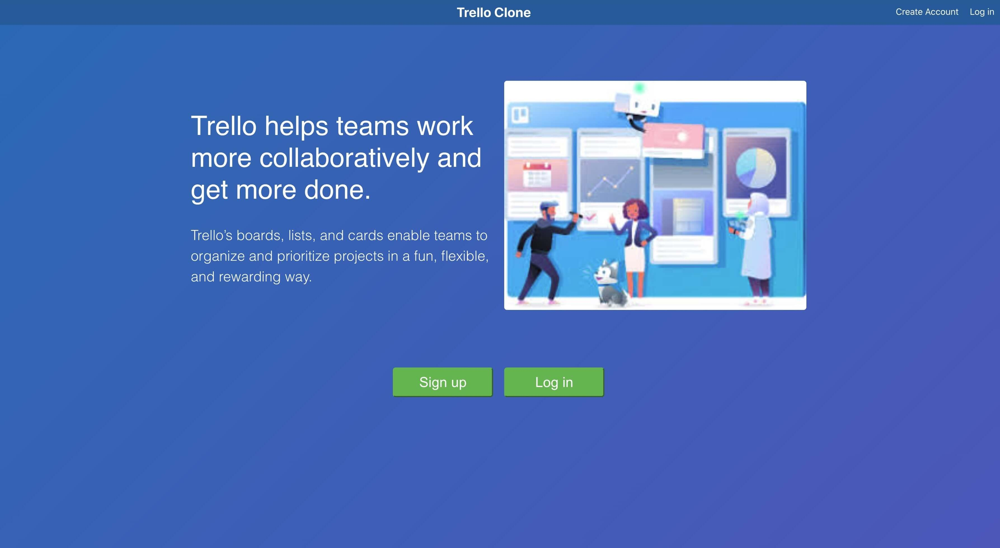

# Trello Clone

A simple clone of Trello created with React and plain CSS. This app is connected to an API created with Nodejs/Express and a postgreSQL database.

## Project Screen Shots

## Installation and Setup Instructions

Clone down this repository. You will need `node` and `npm` installed globally on your machine.

Installation:

`npm install`

To Start Server:

`npm run start`

To Visit the Live App:

`https://trello-clone-mu.vercel.app/`

To try out the app, use the following log in credentials if you prefer not to use your own email address:
Email: testingtrelloclone@trello.com
Password: Testing!123

## Reflection

Goals for building this project included mimicking the user interface and basic functionality of the popular kanban style web app trello utilizing the technologies learned from Bloc software development bootcamp. Features include creation of a new account with email address and password, secure login with authorization (JWT created on the server, stored in session storage), creation of new project boards, lists, and cards/tasks. The interface was built with React, state is managed with React Hooks, and the app is styled with CSS.

The project was started with `create-react-app` boilerplace and utilizes `react-router`.

One of the biggest challenges creating this application was making an Authorization system with JWT's. JWT's are created on the server upon an existing user logging in, and are stored in session storage. JWT's expire after a set period of time and are removed from session storage and the user is logged out automatically if the user goes ideal. This was done by adding event listeners for user interaction with the web page and setting a timer that triggers a function to log out the user if none of the event listeners are triggered for a certain period of time.
